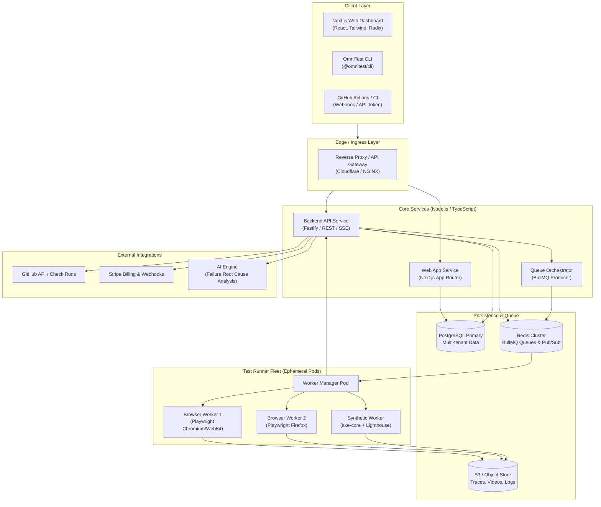
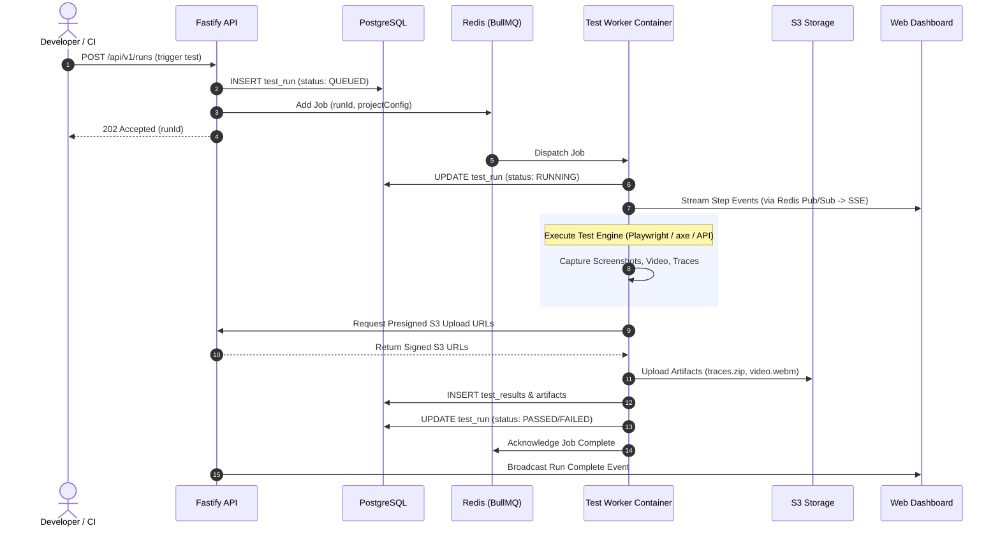

# Technical Architecture Specification — OmniTest

## 1. Architectural Principles

1. **Decoupled Workspaces (Turborepo Monorepo)**:
   Strict separation of concerns across web application, API services, runner engine, database layer, and developer CLI.
2. **TypeScript End-to-End**:
   Shared domain models, runtime schemas (Zod), and type definitions across the entire stack.
3. **Stateless Test Execution**:
   Test workers run in isolated, ephemeral environments with zero state retention between runs.
4. **Asynchronous Orchestration**:
   Long-running test executions are never processed synchronously by web API servers; they are dispatched to a Redis-backed queue system.
5. **No Reinvented Engines**:
   Leverage industry-standard engines (Playwright for browser orchestration, axe-core for accessibility audits, Lighthouse for performance audits) encapsulated behind clean abstraction adapters.

---

## 2. System Architecture Diagram



---

## 3. Monorepo Structure

OmniTest uses **Turborepo** with **pnpm** workspaces:

```
omnitest/
├── apps/
│   ├── web/                     # Next.js 14+ App Router (Dashboard, Auth, Marketing)
│   ├── api/                     # Fastify REST API service (Core backend & Webhooks)
│   └── worker/                  # BullMQ consumer runner service (Dockerized)
│
├── packages/
│   ├── database/                # Prisma ORM schema, client, migrations, and seed scripts
│   ├── types/                   # Shared TypeScript interfaces, enums, and API contracts
│   ├── config/                  # Shared tsconfig, eslint, and prettier configurations
│   ├── ui/                      # Shared design system components (Tailwind + Radix)
│   ├── runner-core/             # Abstract execution engine & adapter interfaces
│   ├── engine-playwright/       # Playwright UI/API testing adapter
│   ├── engine-a11y/             # axe-core accessibility scanner adapter
│   ├── engine-lighthouse/       # Lighthouse performance auditing adapter
│   └── sdk/                     # Official TypeScript SDK & client library
│
├── cli/                         # @omnitest/cli (Local test runner & CI companion)
├── docs/                        # Specifications, schemas, guides, and architecture
├── .env.example                 # Comprehensive environment variable template
├── turbo.json                   # Pipeline caching and build dependency matrix
├── package.json                 # Monorepo root package definition
└── pnpm-workspace.yaml          # Workspace package patterns
```

---

## 4. Component Subsystems

### 4.1 Frontend (`apps/web`)
- **Framework**: Next.js (App Router, React Server Components where appropriate for fast SSR, Client Components for interactive test trees).
- **Styling**: Tailwind CSS + Radix UI primitives (shadcn-compatible pattern).
- **State & Data Fetching**: TanStack React Query for cached server data; Server-Sent Events (SSE) / WebSocket subscriber for real-time test run step logs and progress bars.
- **Artifact Visualizer**: Embedded video player (`.mp4`/`.webm`), interactive DOM snapshot iframe, and side-by-side visual diff slider.

### 4.2 Backend API (`apps/api`)
- **Framework**: Fastify with TypeScript. Selected for high throughput, low latency, robust plugin ecosystem, and schema validation via TypeBox or Zod.
- **Routing**: Modular REST API partitioned by resource domain (`/api/v1/projects`, `/api/v1/runs`, `/api/v1/webhooks`).
- **Validation**: Strict input and response validation using Zod.
- **Real-Time Stream**: SSE endpoint (`GET /api/v1/runs/:id/stream`) broadcasting step events to connected dashboard clients.

### 4.3 Database & Persistence (`packages/database`)
- **Engine**: PostgreSQL 16+.
- **ORM**: Prisma for type-safe queries, relational integrity, and automated migration management.
- **Connection Management**: PgBouncer or serverless connection pooling for high-concurrency worker updates.
- **Tenant Isolation**: All tenant-scoped entities enforce foreign keys referencing `organization_id` with strict database-level index optimizations.

### 4.4 Queue System & Test Orchestration (`packages/runner-core`, `apps/worker`)
- **Queue Engine**: BullMQ on top of Redis 7+.
- **Job Flow**:
  1. API receives a run request (via UI, CLI, or CI webhook).
  2. API creates `test_run` record in status `QUEUED` in PostgreSQL.
  3. API enqueues a job payload onto BullMQ queue `test-runs`.
  4. Worker instances pull jobs based on concurrency quotas.
  5. Worker updates status to `RUNNING` and executes the suite using adapter modules.
  6. Worker streams live step results back to Redis pub/sub.
  7. Worker uploads artifacts (video, trace, screenshot) directly to S3 via presigned PUT URLs.
  8. Worker marks `test_run` as `PASSED` or `FAILED` and persists execution metrics.



### 4.5 Test Engine Adapter Layer
To prevent coupling to a single testing tool, all engines implement the `TestEngineAdapter` interface:

```typescript
export interface TestEngineAdapter {
  readonly engineType: 'playwright' | 'http_api' | 'axe' | 'performance' | 'seo';
  validateConfig(config: unknown): Promise<boolean>;
  execute(context: ExecutionContext): Promise<ExecutionResult>;
  cleanup(): Promise<void>;
}
```

- **`engine-playwright`**: Spawns isolated Playwright browser contexts for UI workflows. Records video, traces, step waterfalls, and screenshots.
- **`http_api`**: Fast native HTTP client executing REST calls with configurable headers, auth (Bearer/Basic/API-Key), query parameters, payloads, and dot-notation JSON assertions.
- **`axe`**: Injects `axe-core` runtime into page contexts; parses WCAG 2.1 A/AA violation nodes with impact scoring (critical, serious, moderate, minor) and visual screenshots.
- **`performance`**: Captures real Core Web Vitals (LCP, CLS) and Navigation Timing API Level 2 metrics (FCP, TTFB, DOM Content Loaded, Load Event) in headless Chromium; evaluates deterministic thresholds across multi-run medians.
- **`seo`**: Technical SEO audit engine inspecting page DOM metadata (title, meta description, canonical, robots directives), heading hierarchy (H1-H6), image semantics, link health, JSON-LD structured data, `/robots.txt`, and XML sitemaps without arbitrary fake scores.

### 4.6 Browser Worker Sandboxing & Isolation
- Each worker runs in an unprivileged Docker container or ephemeral Kubernetes pod.
- Strict resource limits: CPU throttling (2 cores max), memory limits (4GB RAM max), and timeout ceilings (default 10 minutes per run).
- File systems are ephemeral (`tmpfs`); tests are forbidden from accessing host networking or cloud metadata endpoints (`169.254.169.254`).

### 4.7 Artifact Storage Pipeline
- **Object Store**: AWS S3, Cloudflare R2, or MinIO for local development.
- **Upload Strategy**: Zero-proxy direct upload. Workers fetch presigned S3 URLs from the API and upload binary payloads directly to S3.
- **Download Strategy**: Dashboard clients view artifacts via short-lived (15-minute) signed GET URLs to guarantee authorization checks.

### 4.8 Authentication & Authorization
- **Session/Token Management**:
  - Web UI: Secure, `HttpOnly`, `SameSite=Lax` session cookies.
  - CLI & CI: Organization and Project API Tokens prefixed with `omt_live_...` or `omt_test_...` hashed with SHA-256 before storage.
- **RBAC**: Handled at organization and project boundaries with granular permission checks.

### 4.9 Billing & Quotas (`apps/api`)
- **Stripe Billing**: Stripe Checkout for subscription tiers, Stripe Customer Portal for self-serve management, and Stripe Webhooks for real-time tier synchronization.
- **Usage Tracker**: Redis-based atomic counter tracking monthly test minutes and concurrent worker slots, synced to PostgreSQL daily.

### 4.10 AI Diagnostic Layer (Future Phase Integration)
- Isolated microservice or background task invoked only when a test run fails.
- Input context: Failed step assertion, DOM snapshot slice, console errors, and stack trace.
- Output: Structured JSON containing root cause explanation, likely culprit (selector change, network timeout, backend 500), and proposed code fix.

### 4.11 GitHub Integration
- GitHub App with webhook event handlers (`pull_request`, `push`, `check_suite_rerequested`).
- Utilizes the GitHub Checks API to create granular check runs for each suite (UI, API, a11y) and updates status dynamically (`queued` -> `in_progress` -> `completed` with detailed markdown summary).

### 4.12 Unified Reporting & Results Aggregation Layer
- **Pure Functional Compiler**: The reporting engine (`report-generator.ts`) deterministically computes `RunReport` data structures directly from `TestRun` and associated `TestResult` entities without maintaining duplicate summary tables or divergent schemas.
- **Engine Breakdown Aggregation**: Aggregates pass rates, failure rates, and execution durations across all five first-class test engines: `UI`, `API`, `ACCESSIBILITY`, `PERFORMANCE`, and `SEO`.
- **Diagnostic Synthesis**: Synthesizes specific failure snippets depending on test engine type (Playwright step errors, HTTP assertion diffs, axe-core WCAG rule violations, performance threshold breaches, and SEO requirement failures).
- **Security & Privacy Layer**: Automatically scrubs authorization headers, session cookies, and API keys before delivering reports or JSON exports.
- **Consumption Interfaces**:
  - Web UI: `/dashboard/projects/[projectId]/runs/[runId]/report` featuring interactive summary scorecards, engine filter tabs, failure section, and searchable results table.
  - JSON API: `/api/projects/[projectId]/runs/[runId]/report?export=json` with attachment download headers.

### 4.13 Artifact Viewer & Media Explorer Architecture
- **Unified Presentation Layer**: Built directly over existing `Artifact` and `TestResult` database records without duplicate storage mechanisms.
- **Multi-Engine Synthesis (`compileResultArtifacts`)**: Seamlessly unifies physical media (screenshots, trace archives, video recordings) with structured runtime diagnostic evidence (console error logs, network failures, API transactions, axe-core audits, Core Web Vitals, and SEO tags).
- **Security Sandboxing**:
  - HTML artifacts are isolated inside sandboxed `<iframe>` tags (`sandbox=""`) to prevent script execution, DOM access, or cookie theft.
  - Network and API evidence passes through automatic secret masking before serialization.
- **Interactive Inspection**:
  - Desktop two-column layout with collapsible sidebar and category filter tabs (`All`, `Images`, `Logs`, `JSON`, `Trace`, `Video`).
  - Specialized viewers for screenshots (zoom, pan, transparency checkerboard, natural dimensions), formatted JSON, monospace logs with line numbers, HTML5 video player, and Playwright trace archives.
  - Keyboard navigation (`ArrowLeft` / `ArrowRight`), search, one-click copy, and file download.

### 4.14 Visual Regression Testing Architecture
- **Pure Pixel Comparison Engine**: Built on top of `pngjs` and `pixelmatch` for deterministic pixel-level diff calculations on authentic image buffers. Generates exact changed pixel counts, difference percentages, and visual diff image overlays.
- **Dimension Mismatch Protection**: Verifies identical resolution before diffing. If dimensions differ, immediately yields `DIMENSION_MISMATCH` with exact dimensions (`baselineWidth x baselineHeight` vs `currentWidth x currentHeight`).
- **Ignore Regions & Dynamic Selector Masking**: Supports static bounding boxes (`VisualIgnoreRegion[]`) and dynamically evaluated CSS selectors (`ignoreSelectors`) that resolve to element bounding boxes, synchronizing pixel values prior to diff execution to eliminate false positives on timestamps, live feeds, or animations.
- **Baseline Lifecycle & Safety Workflow**:
  - Baselines are immutable and NEVER automatically overwritten on test failure.
  - Tests start in `NO_BASELINE` state; current screenshot is saved as candidate `VISUAL_CURRENT`.
  - Baselines can be created or updated only through explicit user approval with safety confirmation modals.
  - Stored in object store / public artifacts under `/artifacts/baselines/[testId]/baseline.png` with metadata recorded in `db.artifact` (`type: "VISUAL_BASELINE"`).
- **Four-Mode Comparison Viewer**:
  - **Side-by-Side**: Direct baseline vs current visual comparison.
  - **Diff View**: Highlighted pixel differences rendered in vibrant magenta-red.
  - **Split Slider**: Draggable interactive divider (`⟷`) with clip-path wipe effect.
  - **Opacity Overlay**: Adjustable opacity slider (0% to 100%) to spot subtle typography and layout shifts.
- **Reporting & Artifact Integration**: Visual metrics integrated into `TestResult.metrics.visualComparison`, `RunReport` failure diagnostics, and the universal `ArtifactViewerLayout`.
