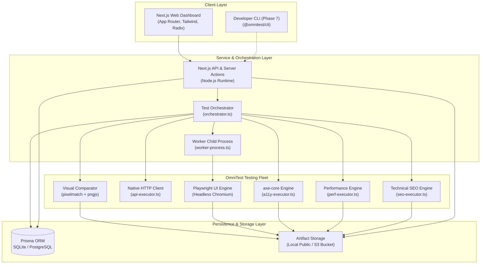

# OmniTest

<p align="center">
  <strong>The Unified Testing Orchestration Platform for Modern Web Applications.</strong><br />
  One platform. Every test. Ship with confidence.
</p>

<p align="center">
  
  
  
  
  
  
  
</p>

---

## Quick Navigation

| Document | Focus Area |
| :--- | :--- |
| [**PRD.md**](./PRD.md) | **Product Requirements Document**: Vision, competitive matrix, personas, and scope |
| [**ARCHITECTURE.md**](./ARCHITECTURE.md) | **System Architecture**: Monorepo layout, worker process isolation, execution pipeline |
| [**ROADMAP.md**](./ROADMAP.md) | **Phased Development Plan**: Rigorous breakdown of deliverables across Phases 0–11 |
| [**PHASE_STATUS.md**](./PHASE_STATUS.md) | **Live Phase Tracker**: Health, completion status, and test suite verification logs |
| [**API.md**](./API.md) | **REST API Reference**: Full endpoint schemas, auth policies, request & response contracts |
| [**SECURITY.md**](./SECURITY.md) | **Security Architecture**: Multi-tenant RBAC, SSRF protections, sandboxed iframe isolation |
| [**docs/database-schema.md**](./docs/database-schema.md) | **Data Model & Schema**: Entity-relationship design, Prisma schema, and state transitions |
| [**docs/testing-engines.md**](./docs/testing-engines.md) | **Testing Capabilities**: Technical breakdown of UI, API, A11y, Performance, and SEO |
| [**docs/user-journeys.md**](./docs/user-journeys.md) | **Core User Journeys**: User workflows, error states, and UX interaction flows |

---

## What is OmniTest?

Modern software engineering teams are forced to maintain a fractured sprawl of isolated testing tools:

- **Playwright or Cypress** for UI workflows
- **Postman or curl scripts** for API checks
- **axe-core or browser extensions** for accessibility compliance
- **Lighthouse or PageSpeed** for performance metrics
- **Screaming Frog or custom crawlers** for technical SEO
- **Percy or Applitools** for visual regression
- **Custom glue code** to collect screenshots, logs, and report statuses to CI

**OmniTest brings these critical disciplines together into a single, cohesive developer platform.**

Instead of managing five dashboards, six configuration files, and multiple disjointed reporting formats, OmniTest executes, analyzes, compares, and reports across every dimension of web quality from a unified control plane.

```text
                                     OmniTest Platform
                                             │
                     ┌───────────────────────┴───────────────────────┐
                     ▼                                               ▼
           Testing Engines                                Presentation & Analysis
           ├── UI / Browser (Playwright)                  ├── Unified Run Reports
           ├── REST API Validation                        ├── Visual Comparison (4 Modes)
           ├── Accessibility (axe-core WCAG)              ├── Multi-Engine Artifact Viewer
           ├── Performance (Web Vitals & Network)         └── Executive Quality Summaries
           ├── Technical SEO & Metadata
           └── Visual Regression (pixelmatch)
```

---

## Project Status & Implementation Matrix

OmniTest follows a disciplined, strictly phased delivery methodology. Features are released only after end-to-end automated verification suites confirm zero regressions.

**Current Milestone**: `Phase 6C — Visual Regression Testing` (✅ Complete and Verified)

| Phase | Module | Status | Engine / Core Technology | Description |
| :--- | :--- | :---: | :--- | :--- |
| **Phase 0** | Blueprint & Specs | ✅ | Architecture Documentation | Full PRD, system design, API contracts, security review |
| **Phase 1** | Landing & Brand | ✅ | Next.js 14, Tailwind CSS | Marketing surface, capabilities preview, dark theme |
| **Phase 2** | SaaS Foundation | ✅ | Prisma ORM, SQLite / PostgreSQL | Multi-tenant auth, organizations, projects, session cookies |
| **Phase 3** | Core Engine | ✅ | Playwright (Headless Chromium) | Isolated worker process runner, sequential step execution |
| **Phase 4** | Test Recorder | ✅ | Playwright Instrumentation | Bi-directional recording session, resilient locator engine |
| **Phase 5A**| API Testing | ✅ | Native HTTP Client | REST requests, Bearer/Basic/Key auth, JSON assertions |
| **Phase 5B**| Accessibility | ✅ | `axe-core 4.x` | WCAG 2.1 A/AA audits, severity tallies, selector snippets |
| **Phase 5C**| Performance | ✅ | Performance & Navigation Timing API | Real browser Web Vitals (LCP, CLS), TTFB, multi-run median |
| **Phase 5D**| Technical SEO | ✅ | DOM Inspection & Fetch Engine | Headings, meta tags, images, JSON-LD, robots.txt, sitemaps |
| **Phase 6A**| Reporting System | ✅ | Pure Functional Compiler | Deterministic run reports, failure diagnostics, JSON export |
| **Phase 6B**| Artifact Viewer | ✅ | Sandboxed Iframe, Media Explorer | Unified inspection of screenshots, traces, logs, and JSON |
| **Phase 6C**| Visual Regression | ✅ | `pixelmatch 7.2` + `pngjs 7.0` | Pixel diffing, ignore regions, baseline management, 4 viewers |
| **Phase 6D**| Test History | ⏳ | Planned | Flakiness index, duration trendlines, historical regressions |
| **Phase 7** | CLI & CI/CD | ⏳ | Planned (`@omnitest/cli`) | Developer CLI, GitHub Actions app, PR comment reporting |
| **Phase 8** | AI Diagnostics | ⏳ | Planned | Root cause failure explanation, heuristic healing |
| **Phase 9** | Billing & Quotas | ⏳ | Planned (Stripe) | Subscription plans, concurrency slots, monthly usage tracking |

---

## Core Capabilities & Engines

### 1. Visual Regression Testing (Phase 6C)

Detects pixel-level visual differences between approved baseline images and candidate screenshots using authentic pixel-by-pixel image comparisons.

```text
Baseline Screenshot ──┐
                      ├──► [pngjs Decoders] ──► [pixelmatch Engine] ──► Exact Difference % ──► PASS / FAIL
Candidate Screenshot ─┘          ▲
                                 │
                   [Ignore Regions & Masked Selectors]
```

- **Mathematical Accuracy**: Computes exact changed pixel counts, total pixels, and difference percentages (`(changed / total) * 100`). Zero fake or randomized scores.
- **Dimension Mismatch Protection**: Validates resolution equivalence before comparing. Flagged immediately as `DIMENSION_MISMATCH` with exact pixel dimensions (e.g. `1280x720` vs `1440x900`) rather than distorting or crashing.
- **Ignore Regions & Dynamic Selector Masking**: Supports static bounding boxes (`VisualIgnoreRegion[]`) and dynamically evaluated CSS selectors (`ignoreSelectors`) that automatically resolve to bounding boxes, synchronizing pixel values before comparison to prevent false positives on live badges, timestamps, or carousels.
- **Immutable Baseline Management**: Test failures never overwrite baselines automatically. Baselines can only be created or replaced via explicit user confirmation with safety modals. Supports promoting candidate run screenshots (`VISUAL_CURRENT`) to golden baselines (`VISUAL_BASELINE`).
- **Four Comparison Viewer Modes**:
  1. **Side-by-Side**: Direct baseline and current comparison with resolution badges.
  2. **Diff View**: Highlighted pixel differences rendered in high-contrast magenta-red.
  3. **Split Slider**: Draggable interactive divider (`⟷`) with real-time `clip-path` wipe.
  4. **Opacity Overlay**: Smooth 0% to 100% opacity slider to spot subtle layout shifts.

```text
Illustrative Visual Comparison Metrics Output:
┌────────────────────────────────────────────────────────────────────────┐
│ Status: FAILED                                                        │
│ Difference: 0.1421%      Threshold: 0.1000%                            │
│ Changed Pixels: 1,842    Total Pixels: 1,296,000                       │
│ Viewport: 1280 × 720     Diff Artifact: visual_diff_d0c1698a.png       │
└────────────────────────────────────────────────────────────────────────┘
```

---

### 2. Browser & UI Testing (Phase 3 & 4)

Executes multi-step browser scenarios inside an isolated, child-process worker pipeline (`worker-process.ts`):

- **Actions Supported**: `goto`, `click`, `fill`, `press`, `wait`, `screenshot`, `assert_url`, `assert_text`, and `assert_visible`.
- **Diagnostic Capture**: Intercepts uncaught page errors, console error records, failed network requests (HTTP 4xx/5xx), step execution duration waterfall, and automatic failure-state screenshots.
- **Bi-Directional Recorder**: Captures browser interactions with a resilient selector prioritizing `data-testid`, semantic attributes, name tags, and stable text.

---

### 3. REST API Testing (Phase 5A)

Fast, native HTTP request execution with deterministic assertions:

- **Methods**: `GET`, `POST`, `PUT`, `PATCH`, `DELETE`, `HEAD`.
- **Authentication**: Bearer tokens, Basic Auth, custom API Key headers.
- **Assertions**: HTTP status code validation, response time ceilings, header presence, and JSON dot-notation body assertions (`data.user.role == "admin"`).
- **Security**: Sensitive headers (`authorization`, `cookie`, `set-cookie`, `x-api-key`) are scrubbed before storage or display.

---

### 4. Automated Accessibility Testing (Phase 5B)

Headless accessibility auditing powered by `axe-core`:

- **Standards**: WCAG 2.0, WCAG 2.1 (Level A & AA), Best Practices.
- **Impact Scoring**: Categorizes violations into `critical`, `serious`, `moderate`, and `minor`.
- **Contextual Findings**: Extracts rule ID, description, help URL, target CSS selector, and raw HTML snippet of offending nodes.
- **Visual Evidence**: Automatically captures and attaches full-page screenshots alongside structured JSON audit evidence.

---

### 5. Web Performance Testing (Phase 5C)

Authentic browser performance measurement via real Chromium execution:

- **Core Web Vitals**: Measures Largest Contentful Paint (LCP) and Cumulative Layout Shift (CLS).
- **Navigation Timing**: First Contentful Paint (FCP), Time to First Byte (TTFB), DOM Content Loaded, and Total Page Load duration.
- **Network Breakdown**: Request tallies, failed requests, transferred payload sizes, and resource classification (JS, CSS, Images, Fonts).
- **Statistical Accuracy**: Supports multi-run median aggregation (warmup run + 3 to 5 measured iterations) to eliminate network jitter noise.

---

### 6. Technical SEO Auditing (Phase 5D)

Automated factual verification of crawlability and indexability signals:

- **Metadata Verification**: Page `<title>`, `<meta name="description">`, and `<link rel="canonical">` validation with character length heuristics.
- **Heading Architecture**: Full heading hierarchy tally (H1 through H6), multiple H1 detection, and skipped heading levels.
- **Content & Link Health**: Content image `alt` verification (differentiating decorative graphics `alt=""`), link health sampling with anti-SSRF protections.
- **Structured Data**: JSON-LD script extraction and schema syntax validation.
- **Directives & Sitemaps**: Host `/robots.txt` disallow directive checks and XML sitemap parsing with strict size and timeout caps.

---

### 7. Unified Reporting & Artifact Viewer (Phase 6A & 6B)

- **Unified Reporting (`report-generator.ts`)**: Pure functional aggregation compiling `TestRun` and `TestResult` records into high-level pass rates, engine breakdown scorecards, failure diagnostics, and secure JSON exports.
- **Multi-Engine Artifact Viewer (`ArtifactViewerLayout.tsx`)**: Reusable presentation layer featuring specialized inspectors for:
  - **Screenshots**: Pan & zoom (fit, actual 100%, + / -), background switcher (dark, light, transparency checkerboard), natural dimensions, fullscreen mode.
  - **Visual Diffs**: Full support for `VISUAL_BASELINE`, `VISUAL_CURRENT`, and `VISUAL_DIFF`.
  - **JSON Evidence**: Syntax-highlighted, formatted, searchable JSON viewer with one-click copy.
  - **Console & Network Logs**: Monospace terminal viewer with line numbering and search filtering.
  - **Playwright Traces**: Interactive trace downloads and local CLI inspection commands.
  - **HTML Previews**: Strict sandboxed `<iframe>` (`sandbox=""`) ensuring isolated rendering with zero access to parent DOM, cookies, or auth tokens.

---

## System Architecture



---

## Technology Stack

| Layer | Technologies | Purpose |
| :--- | :--- | :--- |
| **Framework** | Next.js 14.2 (App Router), React 18 | Full-stack application runtime and server actions |
| **Language** | TypeScript 5.6 | Strict end-to-end type safety across client and server |
| **Styling & UI** | Tailwind CSS 3.4, Lucide Icons | Responsive dark-mode interface and design tokens |
| **Database** | Prisma ORM 5.20 (SQLite / PostgreSQL) | Multi-tenant relational schema, migrations, data mapping |
| **Browser Runner**| Playwright 1.47+ | Headless Chromium execution, network intercept, screenshots |
| **Accessibility** | `axe-core 4.10+` | WCAG 2.1 Level A & AA automated rule evaluations |
| **Visual Diff** | `pixelmatch 7.2+`, `pngjs 7.0+` | Pixel-level difference calculation and diff PNG generation |
| **Security** | `jose`, `bcryptjs` | JWT session management, password hashing, header redaction |

---

## Getting Started Locally

### Prerequisites

- **Node.js**: `v18.18.0` or higher (Node 20+ recommended)
- **npm** or **yarn**

### Installation & Setup

1. **Clone the repository**:
   ```bash
   git clone https://github.com/your-org/omnitest.git
   cd omnitest
   ```

2. **Install dependencies**:
   ```bash
   npm install
   ```

3. **Install Playwright browser binaries**:
   ```bash
   npx playwright install chromium
   ```

4. **Initialize database schema**:
   ```bash
   cd apps/web
   npx prisma db push
   cd ../..
   ```

5. **Start local development server**:
   ```bash
   npm run dev
   ```

Open [http://localhost:3000](http://localhost:3000) to access the landing page and dashboard.

---

## Verification & Test Suites

Every phase in OmniTest is accompanied by an automated, self-contained verification suite. You can execute these scripts at any time to verify system integrity:

```bash
# Verify Phase 6C: Visual Regression Testing
npx tsx scripts/verify-phase6c.ts

# Verify Phase 6B: Artifact Viewer & Multi-Engine Evidence
npx tsx scripts/verify-phase6b.ts

# Verify Phase 6A: Unified Reporting System
npx tsx scripts/verify-phase6a.ts

# Verify Phase 5: Testing Engines
npx tsx scripts/verify-phase5a.ts # API Testing
npx tsx scripts/verify-phase5b.ts # Accessibility Testing
npx tsx scripts/verify-phase5c.ts # Performance Testing
npx tsx scripts/verify-phase5d.ts # Technical SEO Testing

# Verify Phase 3 & 4: Core Engine & Recorder
npx tsx scripts/verify-phase3.ts
npx tsx scripts/verify-phase4.ts
```

To run the complete verification suite across all implemented phases sequentially:

```bash
npx tsx scripts/verify-phase3.ts && \
npx tsx scripts/verify-phase4.ts && \
npx tsx scripts/verify-phase5a.ts && \
npx tsx scripts/verify-phase5b.ts && \
npx tsx scripts/verify-phase5c.ts && \
npx tsx scripts/verify-phase5d.ts && \
npx tsx scripts/verify-phase6a.ts && \
npx tsx scripts/verify-phase6b.ts && \
npx tsx scripts/verify-phase6c.ts
```

### Static Analysis & Production Build

```bash
cd apps/web
npm run typecheck  # npx tsc --noEmit
npm run lint       # next lint
npm run build      # next build
```

---

## Repository Layout

```text
omnitest/
├── apps/
│   └── web/                                # Next.js 14 web application & API
│       ├── prisma/
│       │   └── schema.prisma               # Prisma data model (Multi-tenant schema)
│       ├── public/
│       │   └── artifacts/                  # Local run artifacts & baselines storage
│       └── src/
│           ├── app/                        # Next.js App Router (pages & API routes)
│           │   ├── (auth)/                 # Login & Registration views
│           │   ├── api/                    # REST APIs (runs, tests, baselines, artifacts)
│           │   └── dashboard/              # Authenticated workspace dashboard
│           ├── components/
│           │   ├── a11y/                   # Accessibility UI viewers
│           │   ├── api/                    # API request builder & response viewer
│           │   ├── artifacts/              # Artifact Viewer Layout & media viewers
│           │   ├── performance/            # Performance scorecards & vitals charts
│           │   ├── reports/                # Unified run report components
│           │   ├── seo/                    # Technical SEO findings breakdown
│           │   └── visual/                 # Visual Regression 4-mode viewer & cards
│           └── lib/
│               ├── artifacts/              # Artifact helper & categorization
│               ├── reports/                # Deterministic run report compiler
│               ├── runner/                 # Playwright executor, validators, worker
│               └── visual/                 # Pixelmatch visual comparator & baseline mgr
├── docs/                                   # Domain documentation (Journeys, Engines, DB)
├── scripts/                                # Automated verification test suites (Phases 2-6C)
├── API.md                                  # REST API endpoint reference
├── ARCHITECTURE.md                         # Detailed system & service architecture
├── PHASE_STATUS.md                         # Milestone tracking & phase verification logs
├── PRD.md                                  # Product Requirements Document
├── ROADMAP.md                              # Chronological 11-phase development roadmap
└── SECURITY.md                             # Security policies & sandboxing specification
```

---

## Security & Isolation Principles

- **No Remote Code Execution**: HTML, SVG, and web evidence are strictly rendered inside isolated `<iframe>` environments with empty `sandbox=""` policies, preventing script execution, cookie theft, or local storage access.
- **Automatic Secret Scrubbing**: All API and network traces pass through header redaction filters (`maskSensitiveHeaders`) before persistence or export. Headers matching `authorization`, `cookie`, `set-cookie`, `x-api-key`, `*token*`, or `*secret*` are replaced with masked previews.
- **SSRF Hardening**: Outbound network requests during API and SEO testing are pre-screened through security guards to block access to private IPv4 ranges (`10.0.0.0/8`, `192.168.0.0/16`, `127.0.0.1`) and cloud metadata services (`169.254.169.254`, `metadata.google.internal`).
- **Worker Sandboxing**: Playwright browser instances run in isolated ephemeral child processes with timeout ceilings and memory caps.

For detailed vulnerability reporting and security specifications, see [SECURITY.md](./SECURITY.md).

---

<p align="center">
  <sub>Built with precision for software engineering and QA teams who demand high-fidelity web quality.</sub>
</p>
