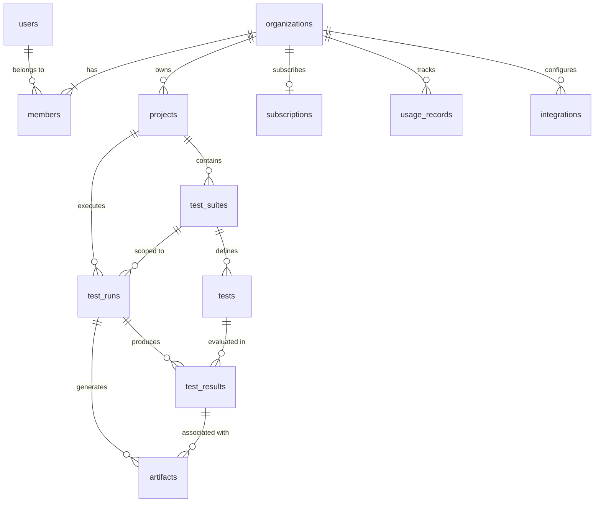

# Database Schema Specification — OmniTest

## 1. Entity-Relationship Overview



---

## 2. Global Enums

```sql
CREATE TYPE user_role AS ENUM ('OWNER', 'ADMIN', 'MEMBER');

CREATE TYPE test_type AS ENUM (
  'UI', 
  'API', 
  'ACCESSIBILITY', 
  'PERFORMANCE', 
  'VISUAL_REGRESSION', 
  'SECURITY'
);

CREATE TYPE run_status AS ENUM (
  'QUEUED', 
  'RUNNING', 
  'PASSED', 
  'FAILED', 
  'TIMED_OUT', 
  'CANCELLED'
);

CREATE TYPE run_trigger AS ENUM (
  'MANUAL', 
  'CLI', 
  'WEBHOOK_GITHUB', 
  'CRON_SCHEDULE', 
  'API'
);

CREATE TYPE artifact_type AS ENUM (
  'VIDEO', 
  'PLAYWRIGHT_TRACE', 
  'SCREENSHOT', 
  'LOG_STDOUT', 
  'LOG_HAR', 
  'LIGHTHOUSE_REPORT', 
  'AXE_REPORT'
);

CREATE TYPE plan_tier AS ENUM ('FREE', 'PRO', 'ENTERPRISE');

CREATE TYPE subscription_status AS ENUM (
  'TRIALING', 
  'ACTIVE', 
  'PAST_DUE', 
  'CANCELED', 
  'UNPAID'
);

CREATE TYPE integration_provider AS ENUM ('GITHUB', 'SLACK', 'DATADOG');
```

---

## 3. Entity Definitions & Table Schemas

### 3.1 `users`
Represents an individual authenticated user.
```sql
CREATE TABLE users (
  id UUID PRIMARY KEY DEFAULT gen_random_uuid(),
  email VARCHAR(255) NOT NULL UNIQUE,
  password_hash VARCHAR(255), -- NULL if OAuth only
  full_name VARCHAR(255) NOT NULL,
  avatar_url TEXT,
  email_verified_at TIMESTAMPTZ,
  created_at TIMESTAMPTZ NOT NULL DEFAULT NOW(),
  updated_at TIMESTAMPTZ NOT NULL DEFAULT NOW()
);

CREATE INDEX idx_users_email ON users(email);
```

### 3.2 `organizations`
The multi-tenant boundary for workspaces, billing, and resource ownership.
```sql
CREATE TABLE organizations (
  id UUID PRIMARY KEY DEFAULT gen_random_uuid(),
  name VARCHAR(255) NOT NULL,
  slug VARCHAR(255) NOT NULL UNIQUE,
  logo_url TEXT,
  created_at TIMESTAMPTZ NOT NULL DEFAULT NOW(),
  updated_at TIMESTAMPTZ NOT NULL DEFAULT NOW()
);

CREATE INDEX idx_organizations_slug ON organizations(slug);
```

### 3.3 `members`
Associates users with organizations and defines their RBAC permissions.
```sql
CREATE TABLE members (
  id UUID PRIMARY KEY DEFAULT gen_random_uuid(),
  organization_id UUID NOT NULL REFERENCES organizations(id) ON DELETE CASCADE,
  user_id UUID NOT NULL REFERENCES users(id) ON DELETE CASCADE,
  role user_role NOT NULL DEFAULT 'MEMBER',
  created_at TIMESTAMPTZ NOT NULL DEFAULT NOW(),
  updated_at TIMESTAMPTZ NOT NULL DEFAULT NOW(),
  CONSTRAINT uq_org_user UNIQUE (organization_id, user_id)
);

CREATE INDEX idx_members_org ON members(organization_id);
CREATE INDEX idx_members_user ON members(user_id);
```

### 3.4 `projects`
Represents an individual application, repository, or service being tested.
```sql
CREATE TABLE projects (
  id UUID PRIMARY KEY DEFAULT gen_random_uuid(),
  organization_id UUID NOT NULL REFERENCES organizations(id) ON DELETE CASCADE,
  name VARCHAR(255) NOT NULL,
  slug VARCHAR(255) NOT NULL,
  description TEXT,
  repository_url TEXT,
  default_branch VARCHAR(100) DEFAULT 'main',
  base_url TEXT,
  encrypted_env_vars TEXT, -- AES-256-GCM encrypted JSON payload
  created_at TIMESTAMPTZ NOT NULL DEFAULT NOW(),
  updated_at TIMESTAMPTZ NOT NULL DEFAULT NOW(),
  CONSTRAINT uq_org_project_slug UNIQUE (organization_id, slug)
);

CREATE INDEX idx_projects_org ON projects(organization_id);
```

### 3.5 `test_suites`
A logical grouping of related tests (e.g. "Smoke Suite", "API Health", "Checkout Flow").
```sql
CREATE TABLE test_suites (
  id UUID PRIMARY KEY DEFAULT gen_random_uuid(),
  project_id UUID NOT NULL REFERENCES projects(id) ON DELETE CASCADE,
  name VARCHAR(255) NOT NULL,
  description TEXT,
  tags TEXT[] DEFAULT '{}',
  created_at TIMESTAMPTZ NOT NULL DEFAULT NOW(),
  updated_at TIMESTAMPTZ NOT NULL DEFAULT NOW()
);

CREATE INDEX idx_test_suites_project ON test_suites(project_id);
```

### 3.6 `tests`
An individual test specification with actions, locators, assertions, or HTTP definitions.
```sql
CREATE TABLE tests (
  id UUID PRIMARY KEY DEFAULT gen_random_uuid(),
  suite_id UUID NOT NULL REFERENCES test_suites(id) ON DELETE CASCADE,
  title VARCHAR(255) NOT NULL,
  description TEXT,
  type test_type NOT NULL DEFAULT 'UI',
  config JSONB NOT NULL, -- Step definitions, endpoints, headers, thresholds
  timeout_seconds INTEGER NOT NULL DEFAULT 60,
  is_active BOOLEAN NOT NULL DEFAULT TRUE,
  created_at TIMESTAMPTZ NOT NULL DEFAULT NOW(),
  updated_at TIMESTAMPTZ NOT NULL DEFAULT NOW()
);

CREATE INDEX idx_tests_suite ON tests(suite_id);
CREATE INDEX idx_tests_type ON tests(type);
```

### 3.7 `test_runs`
An execution instance of one or more test suites.
```sql
CREATE TABLE test_runs (
  id UUID PRIMARY KEY DEFAULT gen_random_uuid(),
  project_id UUID NOT NULL REFERENCES projects(id) ON DELETE CASCADE,
  suite_id UUID REFERENCES test_suites(id) ON DELETE SET NULL,
  status run_status NOT NULL DEFAULT 'QUEUED',
  trigger run_trigger NOT NULL DEFAULT 'MANUAL',
  environment VARCHAR(100) NOT NULL DEFAULT 'staging',
  target_url TEXT NOT NULL,
  git_commit_hash VARCHAR(40),
  git_branch VARCHAR(255),
  git_commit_message TEXT,
  git_pull_request_number INTEGER,
  total_tests INTEGER NOT NULL DEFAULT 0,
  passed_tests INTEGER NOT NULL DEFAULT 0,
  failed_tests INTEGER NOT NULL DEFAULT 0,
  skipped_tests INTEGER NOT NULL DEFAULT 0,
  duration_ms INTEGER,
  started_at TIMESTAMPTZ,
  completed_at TIMESTAMPTZ,
  error_summary TEXT,
  created_at TIMESTAMPTZ NOT NULL DEFAULT NOW()
);

CREATE INDEX idx_test_runs_project ON test_runs(project_id, created_at DESC);
CREATE INDEX idx_test_runs_status ON test_runs(status);
```

### 3.8 `test_results`
Detailed result and assertions evaluation for an individual test inside a run.
```sql
CREATE TABLE test_results (
  id UUID PRIMARY KEY DEFAULT gen_random_uuid(),
  test_run_id UUID NOT NULL REFERENCES test_runs(id) ON DELETE CASCADE,
  test_id UUID REFERENCES tests(id) ON DELETE SET NULL,
  test_title VARCHAR(255) NOT NULL,
  test_type test_type NOT NULL,
  status run_status NOT NULL,
  browser VARCHAR(50),
  duration_ms INTEGER NOT NULL,
  error_message TEXT,
  stack_trace TEXT,
  step_results JSONB NOT NULL DEFAULT '[]', -- Per-step execution log and timings
  metrics JSONB DEFAULT '{}', -- Lighthouse CWV or a11y violation count
  created_at TIMESTAMPTZ NOT NULL DEFAULT NOW()
);

CREATE INDEX idx_test_results_run ON test_results(test_run_id);
CREATE INDEX idx_test_results_status ON test_results(status);
```

### 3.9 `artifacts`
Binary outputs (videos, traces, screenshots, logs) captured during execution.
```sql
CREATE TABLE artifacts (
  id UUID PRIMARY KEY DEFAULT gen_random_uuid(),
  test_run_id UUID NOT NULL REFERENCES test_runs(id) ON DELETE CASCADE,
  test_result_id UUID REFERENCES test_results(id) ON DELETE CASCADE,
  type artifact_type NOT NULL,
  file_name VARCHAR(255) NOT NULL,
  s3_key TEXT NOT NULL,
  s3_bucket VARCHAR(255) NOT NULL,
  content_type VARCHAR(100) NOT NULL,
  size_bytes BIGINT NOT NULL,
  expires_at TIMESTAMPTZ NOT NULL,
  created_at TIMESTAMPTZ NOT NULL DEFAULT NOW()
);

CREATE INDEX idx_artifacts_run ON artifacts(test_run_id);
CREATE INDEX idx_artifacts_result ON artifacts(test_result_id);
CREATE INDEX idx_artifacts_expires ON artifacts(expires_at);
```

### 3.10 `integrations`
Connections to external developer tools (GitHub App, Slack alerts).
```sql
CREATE TABLE integrations (
  id UUID PRIMARY KEY DEFAULT gen_random_uuid(),
  organization_id UUID NOT NULL REFERENCES organizations(id) ON DELETE CASCADE,
  provider integration_provider NOT NULL,
  external_account_id VARCHAR(255) NOT NULL,
  encrypted_access_token TEXT NOT NULL,
  config JSONB DEFAULT '{}', -- Channel IDs, notification flags
  is_active BOOLEAN NOT NULL DEFAULT TRUE,
  created_at TIMESTAMPTZ NOT NULL DEFAULT NOW(),
  updated_at TIMESTAMPTZ NOT NULL DEFAULT NOW(),
  CONSTRAINT uq_org_provider UNIQUE (organization_id, provider, external_account_id)
);

CREATE INDEX idx_integrations_org ON integrations(organization_id);
```

### 3.11 `subscriptions`
Stores Stripe customer links, subscription tier, and concurrency allocations.
```sql
CREATE TABLE subscriptions (
  id UUID PRIMARY KEY DEFAULT gen_random_uuid(),
  organization_id UUID NOT NULL UNIQUE REFERENCES organizations(id) ON DELETE CASCADE,
  stripe_customer_id VARCHAR(255) NOT NULL UNIQUE,
  stripe_subscription_id VARCHAR(255) UNIQUE,
  plan plan_tier NOT NULL DEFAULT 'FREE',
  status subscription_status NOT NULL DEFAULT 'ACTIVE',
  concurrency_limit INTEGER NOT NULL DEFAULT 1,
  monthly_test_minutes_quota INTEGER NOT NULL DEFAULT 300,
  current_period_start TIMESTAMPTZ,
  current_period_end TIMESTAMPTZ,
  created_at TIMESTAMPTZ NOT NULL DEFAULT NOW(),
  updated_at TIMESTAMPTZ NOT NULL DEFAULT NOW()
);

CREATE INDEX idx_subscriptions_org ON subscriptions(organization_id);
CREATE INDEX idx_subscriptions_stripe_customer ON subscriptions(stripe_customer_id);
```

### 3.12 `usage_records`
Metered usage tracking per billing cycle for quota enforcement and overage billing.
```sql
CREATE TABLE usage_records (
  id UUID PRIMARY KEY DEFAULT gen_random_uuid(),
  organization_id UUID NOT NULL REFERENCES organizations(id) ON DELETE CASCADE,
  billing_period_start DATE NOT NULL,
  billing_period_end DATE NOT NULL,
  test_runs_count INTEGER NOT NULL DEFAULT 0,
  test_execution_minutes INTEGER NOT NULL DEFAULT 0,
  peak_concurrency_slots INTEGER NOT NULL DEFAULT 0,
  created_at TIMESTAMPTZ NOT NULL DEFAULT NOW(),
  updated_at TIMESTAMPTZ NOT NULL DEFAULT NOW(),
  CONSTRAINT uq_org_period UNIQUE (organization_id, billing_period_start)
);

CREATE INDEX idx_usage_records_org ON usage_records(organization_id);
```

---

## 4. Prisma Schema Definition (`packages/database/prisma/schema.prisma`)

```prisma
datasource db {
  provider = "postgresql"
  url      = env("DATABASE_URL")
}

generator client {
  provider = "prisma-client-js"
}

enum UserRole {
  OWNER
  ADMIN
  MEMBER
}

enum TestType {
  UI
  API
  ACCESSIBILITY
  PERFORMANCE
  VISUAL_REGRESSION
  SECURITY
}

enum RunStatus {
  QUEUED
  RUNNING
  PASSED
  FAILED
  TIMED_OUT
  CANCELLED
}

enum RunTrigger {
  MANUAL
  CLI
  WEBHOOK_GITHUB
  CRON_SCHEDULE
  API
}

enum ArtifactType {
  VIDEO
  PLAYWRIGHT_TRACE
  SCREENSHOT
  LOG_STDOUT
  LOG_HAR
  LIGHTHOUSE_REPORT
  AXE_REPORT
}

enum PlanTier {
  FREE
  PRO
  ENTERPRISE
}

enum SubscriptionStatus {
  TRIALING
  ACTIVE
  PAST_DUE
  CANCELED
  UNPAID
}

enum IntegrationProvider {
  GITHUB
  SLACK
  DATADOG
}

model User {
  id               String    @id @default(uuid()) @db.Uuid
  email            String    @unique @db.VarChar(255)
  passwordHash     String?   @map("password_hash") @db.VarChar(255)
  fullName         String    @map("full_name") @db.VarChar(255)
  avatarUrl        String?   @map("avatar_url")
  emailVerifiedAt  DateTime? @map("email_verified_at") @db.Timestamptz
  createdAt        DateTime  @default(now()) @map("created_at") @db.Timestamptz
  updatedAt        DateTime  @updatedAt @map("updated_at") @db.Timestamptz
  memberships      Member[]

  @@map("users")
}

model Organization {
  id           String        @id @default(uuid()) @db.Uuid
  name         String        @db.VarChar(255)
  slug         String        @unique @db.VarChar(255)
  logoUrl      String?       @map("logo_url")
  createdAt    DateTime      @default(now()) @map("created_at") @db.Timestamptz
  updatedAt    DateTime      @updatedAt @map("updated_at") @db.Timestamptz
  members      Member[]
  projects     Project[]
  subscription Subscription?
  usageRecords UsageRecord[]
  integrations Integration[]

  @@map("organizations")
}

model Member {
  id             String       @id @default(uuid()) @db.Uuid
  organizationId String       @map("organization_id") @db.Uuid
  userId         String       @map("user_id") @db.Uuid
  role           UserRole     @default(MEMBER)
  createdAt      DateTime     @default(now()) @map("created_at") @db.Timestamptz
  updatedAt      DateTime     @updatedAt @map("updated_at") @db.Timestamptz
  organization   Organization @relation(fields: [organizationId], references: [id], onDelete: Cascade)
  user           User         @relation(fields: [userId], references: [id], onDelete: Cascade)

  @@unique([organizationId, userId])
  @@map("members")
}

model Project {
  id               String      @id @default(uuid()) @db.Uuid
  organizationId   String      @map("organization_id") @db.Uuid
  name             String      @db.VarChar(255)
  slug             String      @db.VarChar(255)
  description      String?
  repositoryUrl    String?     @map("repository_url")
  defaultBranch    String      @default("main") @map("default_branch") @db.VarChar(100)
  baseUrl          String?     @map("base_url")
  encryptedEnvVars String?     @map("encrypted_env_vars")
  createdAt        DateTime    @default(now()) @map("created_at") @db.Timestamptz
  updatedAt        DateTime    @updatedAt @map("updated_at") @db.Timestamptz
  organization     Organization @relation(fields: [organizationId], references: [id], onDelete: Cascade)
  testSuites       TestSuite[]
  testRuns         TestRun[]

  @@unique([organizationId, slug])
  @@map("projects")
}

model TestSuite {
  id          String    @id @default(uuid()) @db.Uuid
  projectId   String    @map("project_id") @db.Uuid
  name        String    @db.VarChar(255)
  description String?
  tags        String[]  @default([])
  createdAt   DateTime  @default(now()) @map("created_at") @db.Timestamptz
  updatedAt   DateTime  @updatedAt @map("updated_at") @db.Timestamptz
  project     Project   @relation(fields: [projectId], references: [id], onDelete: Cascade)
  tests       Test[]
  testRuns    TestRun[]

  @@map("test_suites")
}

model Test {
  id             String       @id @default(uuid()) @db.Uuid
  suiteId        String       @map("suite_id") @db.Uuid
  title          String       @db.VarChar(255)
  description    String?
  type           TestType     @default(UI)
  config         Json
  timeoutSeconds Int          @default(60) @map("timeout_seconds")
  isActive       Boolean      @default(true) @map("is_active")
  createdAt      DateTime     @default(now()) @map("created_at") @db.Timestamptz
  updatedAt      DateTime     @updatedAt @map("updated_at") @db.Timestamptz
  suite          TestSuite    @relation(fields: [suiteId], references: [id], onDelete: Cascade)
  testResults    TestResult[]

  @@map("tests")
}

model TestRun {
  id                   String       @id @default(uuid()) @db.Uuid
  projectId            String       @map("project_id") @db.Uuid
  suiteId              String?      @map("suite_id") @db.Uuid
  status               RunStatus    @default(QUEUED)
  trigger              RunTrigger   @default(MANUAL)
  environment          String       @default("staging") @db.VarChar(100)
  targetUrl            String       @map("target_url")
  gitCommitHash        String?      @map("git_commit_hash") @db.VarChar(40)
  gitBranch            String?      @map("git_branch") @db.VarChar(255)
  gitCommitMessage     String?      @map("git_commit_message")
  gitPullRequestNumber Int?         @map("git_pull_request_number")
  totalTests           Int          @default(0) @map("total_tests")
  passedTests          Int          @default(0) @map("passed_tests")
  failedTests          Int          @default(0) @map("failed_tests")
  skippedTests         Int          @default(0) @map("skipped_tests")
  durationMs           Int?         @map("duration_ms")
  startedAt            DateTime?    @map("started_at") @db.Timestamptz
  completedAt          DateTime?    @map("completed_at") @db.Timestamptz
  errorSummary         String?      @map("error_summary")
  createdAt            DateTime     @default(now()) @map("created_at") @db.Timestamptz
  project              Project      @relation(fields: [projectId], references: [id], onDelete: Cascade)
  suite                TestSuite?   @relation(fields: [suiteId], references: [id], onDelete: SetNull)
  testResults          TestResult[]
  artifacts            Artifact[]

  @@map("test_runs")
}

model TestResult {
  id           String     @id @default(uuid()) @db.Uuid
  testRunId    String     @map("test_run_id") @db.Uuid
  testId       String?    @map("test_id") @db.Uuid
  testTitle    String     @map("test_title") @db.VarChar(255)
  testType     TestType   @map("test_type")
  status       RunStatus
  browser      String?    @db.VarChar(50)
  durationMs   Int        @map("duration_ms")
  errorMessage String?    @map("error_message")
  stackTrace   String?    @map("stack_trace")
  stepResults  Json       @default("[]") @map("step_results")
  metrics      Json?      @default("{}")
  createdAt    DateTime   @default(now()) @map("created_at") @db.Timestamptz
  testRun      TestRun    @relation(fields: [testRunId], references: [id], onDelete: Cascade)
  test         Test?      @relation(fields: [testId], references: [id], onDelete: SetNull)
  artifacts    Artifact[]

  @@map("test_results")
}

model Artifact {
  id           String       @id @default(uuid()) @db.Uuid
  testRunId    String       @map("test_run_id") @db.Uuid
  testResultId String?      @map("test_result_id") @db.Uuid
  type         ArtifactType
  fileName     String       @map("file_name") @db.VarChar(255)
  s3Key        String       @map("s3_key")
  s3Bucket     String       @map("s3_bucket") @db.VarChar(255)
  contentType  String       @map("content_type") @db.VarChar(100)
  sizeBytes    BigInt       @map("size_bytes")
  expiresAt    DateTime     @map("expires_at") @db.Timestamptz
  createdAt    DateTime     @default(now()) @map("created_at") @db.Timestamptz
  testRun      TestRun      @relation(fields: [testRunId], references: [id], onDelete: Cascade)
  testResult   TestResult?  @relation(fields: [testResultId], references: [id], onDelete: Cascade)

  @@map("artifacts")
}

model Integration {
  id                  String              @id @default(uuid()) @db.Uuid
  organizationId      String              @map("organization_id") @db.Uuid
  provider            IntegrationProvider
  externalAccountId   String              @map("external_account_id") @db.VarChar(255)
  encryptedAccessToken String             @map("encrypted_access_token")
  config              Json?               @default("{}")
  isActive            Boolean             @default(true) @map("is_active")
  createdAt           DateTime            @default(now()) @map("created_at") @db.Timestamptz
  updatedAt           DateTime            @updatedAt @map("updated_at") @db.Timestamptz
  organization        Organization        @relation(fields: [organizationId], references: [id], onDelete: Cascade)

  @@unique([organizationId, provider, externalAccountId])
  @@map("integrations")
}

model Subscription {
  id                      String             @id @default(uuid()) @db.Uuid
  organizationId          String             @unique @map("organization_id") @db.Uuid
  stripeCustomerId        String             @unique @map("stripe_customer_id") @db.VarChar(255)
  stripeSubscriptionId    String?            @unique @map("stripe_subscription_id") @db.VarChar(255)
  plan                    PlanTier           @default(FREE)
  status                  SubscriptionStatus @default(ACTIVE)
  concurrencyLimit        Int                @default(1) @map("concurrency_limit")
  monthlyTestMinutesQuota Int                @default(300) @map("monthly_test_minutes_quota")
  currentPeriodStart      DateTime?          @map("current_period_start") @db.Timestamptz
  currentPeriodEnd        DateTime?          @map("current_period_end") @db.Timestamptz
  createdAt               DateTime           @default(now()) @map("created_at") @db.Timestamptz
  updatedAt               DateTime           @updatedAt @map("updated_at") @db.Timestamptz
  organization            Organization       @relation(fields: [organizationId], references: [id], onDelete: Cascade)

  @@map("subscriptions")
}

model UsageRecord {
  id                    String       @id @default(uuid()) @db.Uuid
  organizationId        String       @map("organization_id") @db.Uuid
  billingPeriodStart    DateTime     @map("billing_period_start") @db.Date
  billingPeriodEnd      DateTime     @map("billing_period_end") @db.Date
  testRunsCount         Int          @default(0) @map("test_runs_count")
  testExecutionMinutes  Int          @default(0) @map("test_execution_minutes")
  peakConcurrencySlots  Int          @default(0) @map("peak_concurrency_slots")
  createdAt             DateTime     @default(now()) @map("created_at") @db.Timestamptz
  updatedAt             DateTime     @updatedAt @map("updated_at") @db.Timestamptz
  organization          Organization @relation(fields: [organizationId], references: [id], onDelete: Cascade)

  @@unique([organizationId, billingPeriodStart])
  @@map("usage_records")
}
```
