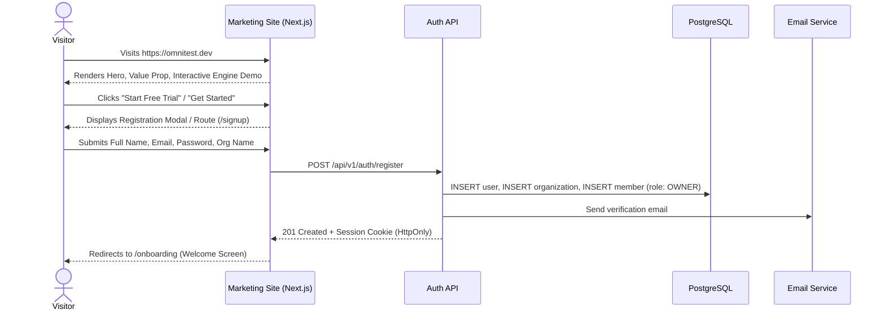
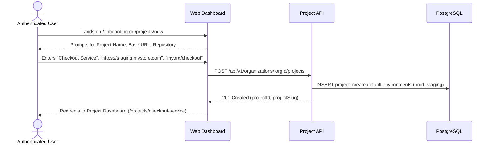
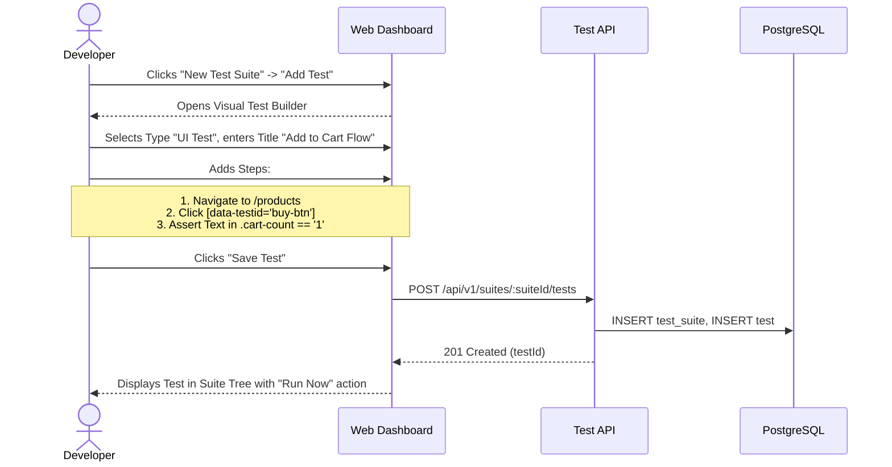
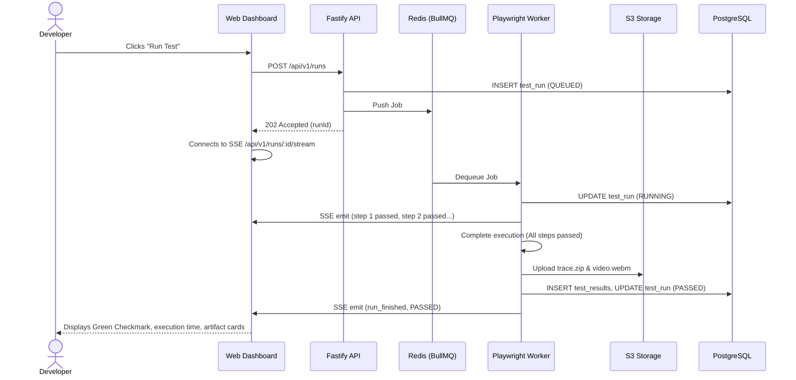
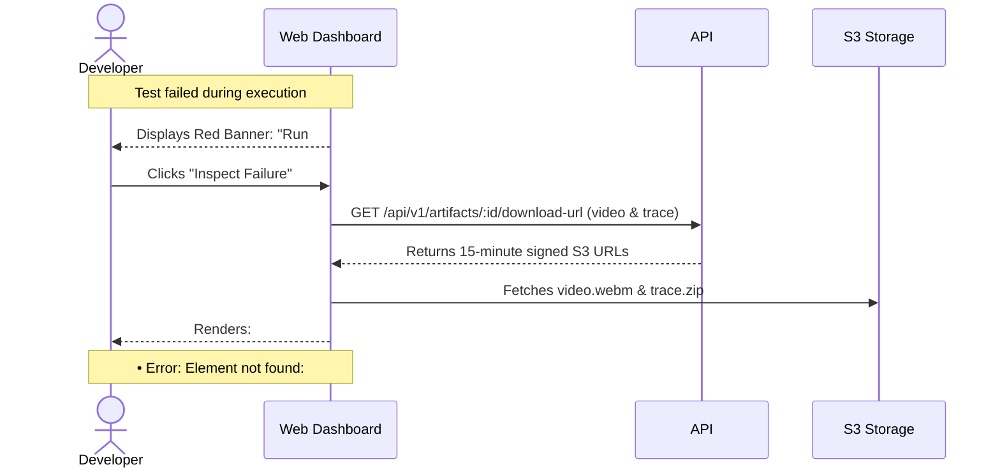
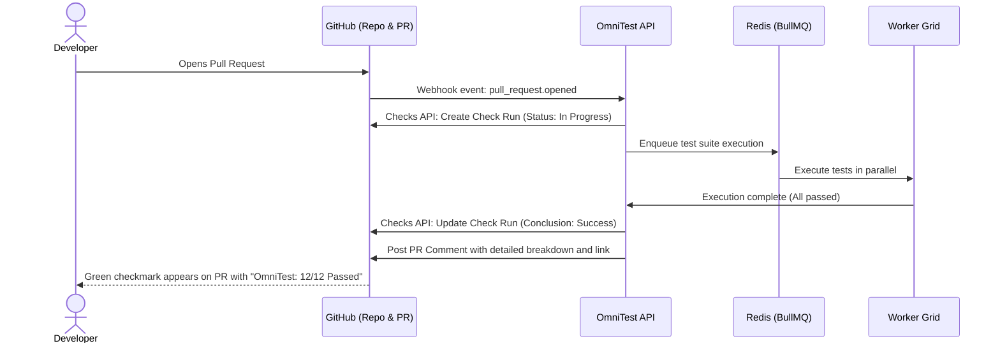
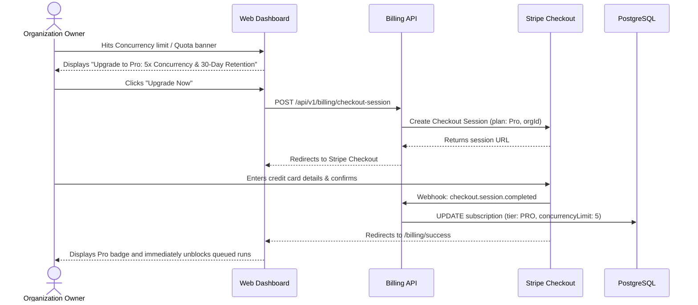
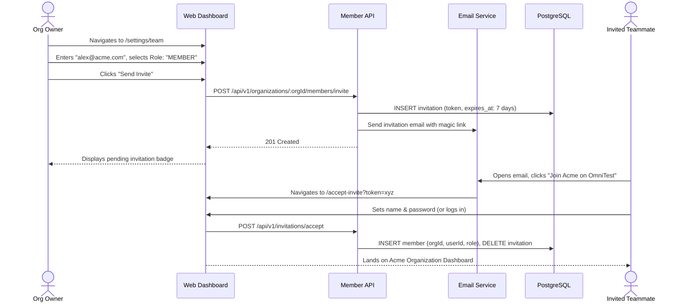

# Core User Journeys — OmniTest

This document defines the 8 canonical user journeys for OmniTest. Each journey details the user intent, step-by-step UX interactions, system responses, state mutations, and edge case handling.

---

## Journey 1: Visitor → Landing Page → Signup

- **Actor**: Prospective developer or engineering lead.
- **Entry Point**: Public marketing landing page.
- **Goal**: Evaluate OmniTest's capabilities and create an active trial account.
- **Step-by-Step Flow**:
  1. Visitor lands on `https://omnitest.dev`.
  2. Visitor reads the unified value proposition ("One platform. Every test.") and toggles the interactive test runner demo comparing UI, API, and accessibility tabs.
  3. Visitor clicks "Get Started Free".
  4. Visitor chooses between "Continue with GitHub" (OAuth) or entering work email and password.
  5. Upon submission, the API creates the User profile, generates a default personal organization, and issues a secure `HttpOnly` session cookie.
  6. The user is redirected to the onboarding wizard.
- **Edge Cases & Error Handling**:
  - *Email already registered*: UI highlights field with "Account already exists. Log in instead."
  - *Weak password*: Real-time client-side password entropy indicator prevents submission if under 8 characters or lacking required complexity.

---

## Journey 2: Signup → Create Project

- **Actor**: Newly onboarded user or organization admin.
- **Entry Point**: Onboarding wizard or "New Project" button in dashboard header.
- **Goal**: Establish a project container to hold test suites and environment configs.
- **Step-by-Step Flow**:
  1. User navigates to `/projects/new`.
  2. User fills in:
     - Project Name (e.g., "Web Storefront").
     - Target Staging URL (e.g., `https://staging.mystore.com`).
     - Git Repository URL (optional for CI linkage).
  3. User optionally configures initial encrypted environment variables (e.g. `TEST_USER_PASSWORD`).
  4. User clicks "Create Project".
  5. Backend generates a slug, provisions default target environments (`production`, `staging`, `preview`), and initializes project metadata.
  6. User lands on the project overview page showing zero runs and a CTA: "Create your first test suite".
- **Edge Cases & Error Handling**:
  - *Duplicate project slug*: Slug automatically appends an incremental counter (e.g., `web-storefront-2`).
  - *Malformed Base URL*: Input validation blocks URLs missing valid protocol schemes (`http://` or `https://`).

---

## Journey 3: Create Project → Create Test

- **Actor**: Developer or QA engineer.
- **Entry Point**: Project Suite list (`/projects/:slug/suites`).
- **Goal**: Author an executable test specification without writing complex infrastructure boilerplate.
- **Step-by-Step Flow**:
  1. User clicks "New Test Suite" and names it "E-Commerce Smoke".
  2. Inside the suite, clicks "+ Add Test".
  3. Selects test type: `UI Test` (or `API Test`, `Accessibility Scan`, `Performance Audit`).
  4. Defines step actions:
     - Step 1: `navigate` -> `/catalog`
     - Step 2: `click` -> `[data-testid='first-item']`
     - Step 3: `click` -> `#add-to-cart-button`
     - Step 4: `assert_text` -> `#cart-qty` equals `"1"`
  5. Sets execution timeout (default: 60s) and browser selection (`Chromium`).
  6. Clicks "Save Test".
- **Edge Cases & Error Handling**:
  - *Invalid selector syntax*: Step builder validates CSS/XPath selector format before submission.
  - *Missing mandatory step parameter*: Visual badge highlights incomplete action step.

---

## Journey 4: Run Test → Test Result

- **Actor**: Developer running a validation check.
- **Entry Point**: Test Suite detail view or CLI.
- **Goal**: Execute the test and receive immediate, deterministic feedback.
- **Step-by-Step Flow**:
  1. User clicks "Run Test" or invokes `omnitest run --test=<id>`.
  2. API assigns a unique `runId`, records status `QUEUED`, and dispatches the job to BullMQ.
  3. Web dashboard switches to Live Inspector and establishes an SSE stream connection.
  4. Worker claims job, boots headless browser, navigates to target URL, and executes steps sequentially.
  5. Each step completion emits a real-time event to the dashboard (e.g. `Step 1: Navigated (210ms)`).
  6. All steps succeed. Worker packages artifacts (video, execution trace) and uploads them to S3.
  7. Worker writes final `PASSED` status and duration metrics.
  8. Dashboard transitions to "Run Complete" state, showing duration, memory usage, and artifact playback buttons.
- **Edge Cases & Error Handling**:
  - *Worker crash or OOM*: Redis heartbeat watchdog detects stalled job after 30s and marks run `FAILED` with message: "Worker container terminated unexpectedly."

---

## Journey 5: Failed Test → Debug Evidence

- **Actor**: Developer debugging a regression.
- **Entry Point**: Failure notification or red badge on test dashboard.
- **Goal**: Identify the exact root cause of failure without having to recreate the bug locally.
- **Step-by-Step Flow**:
  1. Developer opens the failed run view (`/runs/:runId`).
  2. Dashboard displays red banner: `Failed at Step 3: click('#submit-checkout') - Timed out after 10000ms`.
  3. Developer clicks "Inspect Trace & Video".
  4. Dashboard loads embedded video player automatically scrubbed to the exact timestamp of failure.
  5. Alongside the video, the developer scrubs through the interactive DOM snapshot timeline.
  6. Developer inspects the Console Logs and Network Waterfall tabs:
     - Notice a `POST /api/checkout` returned `HTTP 500 Internal Server Error`.
     - Button was disabled waiting for network request to resolve.
  7. Developer identifies that the backend staging database had a locked record, fixes the issue, and clicks "Rerun Test".
- **Edge Cases & Error Handling**:
  - *Corrupted or truncated trace*: If trace upload was aborted due to container crash, UI displays fallback console output and captured fatal error message.

---

## Journey 6: Connect GitHub → CI Test

- **Actor**: Developer opening a pull request.
- **Entry Point**: GitHub Pull Request page.
- **Goal**: Automatically validate branch changes before merging into production.
- **Step-by-Step Flow**:
  1. In OmniTest project settings, user clicks "Connect GitHub Repository" and authorizes the OmniTest GitHub App.
  2. Developer pushes a branch and opens PR `#42` on GitHub.
  3. GitHub sends a `pull_request.opened` webhook to OmniTest API.
  4. OmniTest creates a GitHub Check Run in status `in_progress`.
  5. The test suite executes on the cloud worker grid against the PR's ephemeral preview URL.
  6. Upon completion, OmniTest updates the GitHub Check Run to `success` or `failure`.
  7. OmniTest posts a markdown comment on the PR containing:
     - Total tests run, duration, and pass/fail summary.
     - Direct links to failed test videos and traces.
     - Core Web Vitals score delta vs. base branch.
- **Edge Cases & Error Handling**:
  - *Webhook signature mismatch*: API discards request immediately with `401 Unauthorized` without enqueuing tasks.
  - *Repository disconnected or App uninstalled*: System records an alert in project settings and skips job queue.

---

## Journey 7: Free User → Upgrade to Pro

- **Actor**: Organization Owner or Admin.
- **Entry Point**: Usage quota warning banner or Billing Settings (`/settings/billing`).
- **Goal**: Increase concurrent test execution slots and extend artifact retention.
- **Step-by-Step Flow**:
  1. User triggers a test suite that exceeds the Free plan concurrency cap (1 concurrent runner).
  2. A banner appears: *"Execution queued. Upgrade to Pro for 5 parallel runners and 30-day artifact retention."*
  3. User clicks "Upgrade to Pro".
  4. OmniTest API generates a Stripe Checkout Session with metadata linking the organization UUID.
  5. User completes payment on Stripe-hosted checkout.
  6. Stripe emits `checkout.session.completed` webhook to OmniTest API.
  7. OmniTest activates the Pro subscription in PostgreSQL and increases concurrency quota to 5.
  8. User is returned to dashboard; the queued jobs immediately execute in parallel.
- **Edge Cases & Error Handling**:
  - *Payment failure / card declined*: Stripe informs user on checkout page; no database quota mutation occurs.
  - *Webhook delay*: UI polls `/api/v1/organizations/:orgId/subscription` on return with a spinner until webhook confirms upgrade.

---

## Journey 8: Team Creation → Invite Members

- **Actor**: Organization Owner or Admin inviting collaborators.
- **Entry Point**: Team Settings (`/settings/team`).
- **Goal**: Onboard developers to an organization with role-based access control.
- **Step-by-Step Flow**:
  1. Owner navigates to Organization Settings -> Team.
  2. Clicks "Invite Member".
  3. Enters teammate's email (`alex@acme.com`) and selects Role (`Admin` or `Member`).
  4. API generates a cryptographically secure token (valid for 7 days) and sends an invite email.
  5. Invited colleague clicks the invitation link.
  6. If colleague is a new user, they set their password; if an existing user, they confirm acceptance.
  7. System associates the user with the organization under the assigned role.
  8. Teammate gains access to all organization projects and test suites according to RBAC rules.
- **Edge Cases & Error Handling**:
  - *Expired invitation token*: If accepted after 7 days, user sees "Invitation expired. Please ask your administrator to resend."
  - *User already member of organization*: Form displays validation error: "User is already a member of this organization."
